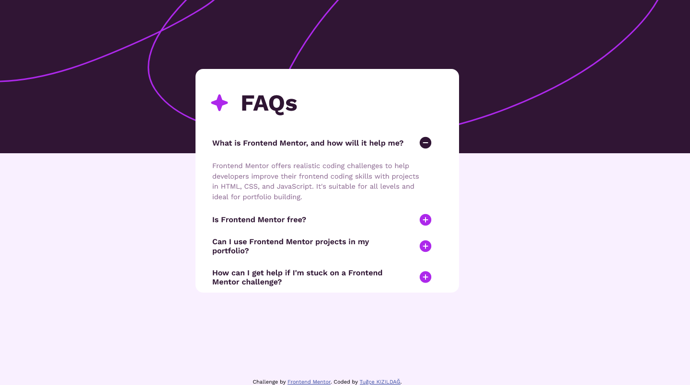
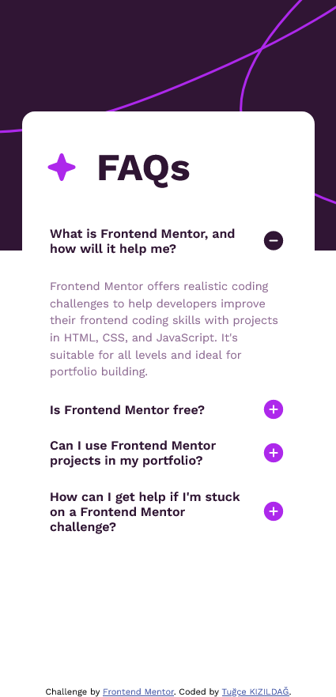

# Frontend Mentor - FAQ accordion solution

This is a solution to the [FAQ accordion challenge on Frontend Mentor](https://www.frontendmentor.io/challenges/faq-accordion-wyfFdeBwBz). Frontend Mentor challenges help you improve your coding skills by building realistic projects. 

### Screenshot

### Links

- Solution URL: [Add solution URL here](https://github.com/tugcekizildg/FAQ-Accordion-Challenge)
- Live Site URL: [Add live site URL here](https://667ed35d556142328069a16b--zippy-malasada-49db2b.netlify.app)

## My process

### Built with

- Semantic HTML5 markup
- CSS custom properties
- Flexbox
- JavaScript

## Author
- Frontend Mentor - [@tugcekizildg](https://www.frontendmentor.io/profile/tugcekizildg)

